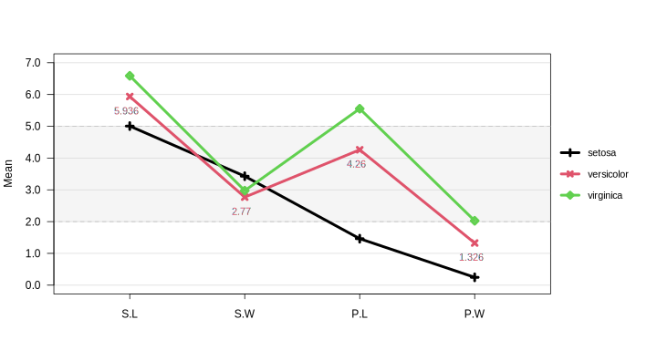
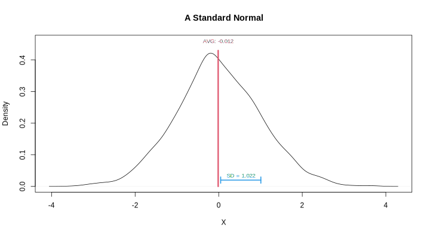

My love for the base R plotting system has been growing since I started
dealing with complicated charts. Complexity in these charts can arise
for many reasons. For one, it might simply result from the data
structure when working with complex statistical models (e.g., multilevel
models). Conventions in the workplace could be another source of
complexity. For instance, tweaking a chart in R to replicate the one
originally created in Excel could be extremely difficult, and it is
nearly impossible to do so with higher-level plotting packages such as
`ggplot2`. To approach the look of a chart created outside of R, life
would be much easier if lower-level frameworks such as the base R
plotting system are utilized.

Below is just a cumulation of charts I’ve created. It is intended to
help me search and locate the code for plotting certain features in base
R. The remainder of the post is divided into sections by charts, each of
which consists of (1) the code, (2) the output chart, and (3) a list of
features presented in the chart.

## Interaction Plots

### Features

- Legend outside of plotting region: `par()`, `legend()`, `mar`, `xpd`,
  `inset`
- Shaded region: `polygon()`
- Custom axis (categorical axis): `axis()`
- text / label: `text()`

### Code & Plot

``` r
library(stom)
library(dplyr)

#### Data ####
d = iris |> 
    group_by(Species) |> 
    summarise(
        S.L = mean(Sepal.Length),
        S.W = mean(Sepal.Width),
        P.L = mean(Petal.Length),
        P.W = mean(Petal.Width)
    )
d

#### Annotations ####
(LABELS = colnames(d)[-1])
```

    # A tibble: 3 × 5
      Species      S.L   S.W   P.L   P.W
      <fct>      <dbl> <dbl> <dbl> <dbl>
    1 setosa      5.01  3.43  1.46 0.246
    2 versicolor  5.94  2.77  4.26 1.33 
    3 virginica   6.59  2.97  5.55 2.03 
    [1] "S.L" "S.W" "P.L" "P.W"

``` r
#### Plot ####
#       c( b,   l,   t,   r )       
par( mar=c(5.1, 4.1, 4.1, 8.1), xpd=F )  # Larger right margin for legend
plot( 1, type="n", xlim=c(.5, 4.5), ylim=c(0,7),
      xlab="", ylab="Mean",
      xaxt="n", yaxt="n")  # disable x/y-axis
# Shaded region (coordinates are specified (counter-)clockwise)
polygon( c(0,4.9,4.9,0),c(2,2,5,5), col=col.alpha("grey",.15), lty=2, border="grey" )
# Auxiliary lines
for ( h in 0:7 )
    abline( h=h, col=col.alpha("grey") )
# Lines & Points
for ( i in 1:nrow(d) ) {
    lines ( 1:4, d[i,-1], col=i, lwd=4 )
    points( 1:4, d[i,-1], col=i, lwd=4, pch=2+i )
}
# Labels
for ( i in 1:nrow(d) ) {
    if ( i != 2 ) next
    text( 1:4-.03, d[i,-1]-.45, labels = d[i,-1], cex=.9, col=i )
}
# Axis
axis( 1, at=1:4, tck=-.02, labels=LABELS )
axis( 2, at=0:7, labels=sprintf("%.1f", 0:7), las=1 )  # rotated y-axis labels
# Legend (outside of plotting region)
legend("right", legend=d$Species, inset=c(-.17,0), xpd=TRUE, 
       col=1:nrow(d), pch=1:nrow(d) + 2, lwd=4, cex=.9, 
       y.intersp=1.8, box.col="transparent", bg="transparent" )
```



## Density Plots

### Features

- Line segments: `segments()`
- Density: `density()`
- text / label: `text()`

### Code & Plot

``` r
library(stom)
library(dplyr)

#### Data ####
set.seed(2020)
d = data.frame(
    x = rnorm(2000)
)

#### Annotations ####
X  = d$x
AVG = mean(X)
SD  = sd(X)

#### Plot ####
plot( density(X), ylim=c(0,.46),
      main = "A Standard Normal", xlab = "X" )
# Mean line segment
segments( x0=AVG, y0=0, y1=.43, col=2, lwd=3 )
text( AVG, .46, labels = paste("AVG:",round(AVG,3)), col=2, cex=.8 )
# SD line segment
segments( x0=AVG+.06, x1=AVG+SD, y0=.02, lwd=2, col=4 )
segments( x0=AVG+.06, y0=.01, y1=.03,    lwd=2, col=4 )
segments( x0=AVG+SD,  y0=.01, y1=.03,    lwd=2, col=4 )
text( .5*(AVG+SD+.06), .035, 
      labels = paste("SD =",round(SD,3)), col=4, cex=.8 )
```


